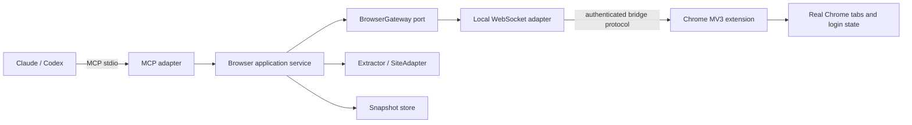

# Browser MCP 架构设计

> 状态：已确认，进入实施计划阶段
> 来源项目：`/Users/leeo/Code/github/ywleeo/robin`
> 来源基线：Git `5bded8435fd105f4cbc68423ef4b93854f9a5e78`，并纳入当前工作区中对通用网页超时快照的未提交改进
> 目标项目：`/Users/leeo/Code/github/ywleeo/browser-mcp`

## 1. 目标

把 Robin 中与浏览器读取有关的能力拆成一个独立、本地优先的 MCP Server，使 Claude、Codex 及其他 MCP 客户端可以直接调用用户真实 Chrome 会话，读取动态页面、登录后页面和站点结构化内容。

交付形态应满足：

- 一个由 `uv` 管理、可直接运行的 Python MCP 应用，默认使用 stdio transport；稳定后可再提供单文件打包产物。
- 一个独立的 Chrome MV3 extension，不再依赖 Tauri 或 Robin 进程。
- 源码运行时使用项目根目录的固定 `extension/`，便于 GitHub 发布和开发者模式加载；wheel
  安装等无源码目录场景才释放到用户数据目录。MCP 工具始终返回实际目录和连接状态。
- 通用网页读取与站点专用解析相互独立，新增站点不会污染 MCP、bridge 或全局模块。
- 默认只读；会引起网站状态变化的点击、输入、上传和任意脚本执行不进入首个 MVP。
- 大内容使用不可变快照分页，不依赖模型反复重新加载网页。

## 2. 非目标

首个版本不做以下事情：

- 不迁移 Robin 的 Agent、Tauri UI、模型配置、文件工具或工作流系统。
- 不把 Chrome extension 打包成商店发布版本；先采用开发者模式加载 unpacked extension。
- 不提供公网 MCP 服务。首选本地 stdio，避免额外的鉴权和远程浏览器安全边界。
- 不在 MVP 中开放 `click`、`type`、`upload`、`eval` 等写入型浏览器自动化。
- 不保证所有历史站点工具在 MVP 同时可用；站点适配器在通用读取稳定后逐个迁移。

## 3. 源码审计结论

### 3.1 Chrome extension bridge

Robin 的 bridge 位于：

- `src-tauri/src/extension/`
- `src-tauri/resources/robin-signer/`

现有实现已经具备较完整的本地浏览器数据面：

- Rust 在 `127.0.0.1` 的连续端口池监听 WebSocket。
- MV3 service worker 同时连接端口池，支持多个 Robin 进程共享一个 Chrome profile。
- 每个 bridge 端口拥有独立 Chrome tab bucket；同一 bucket 内通过 FIFO 串行导航操作。
- 请求以 UUID 关联 reply，断连时会清空 pending request，避免调用一直等待超时。
- 20 秒 ping 保活，解决 MV3 service worker 空闲回收问题。
- extension bundle 有 build fingerprint，可发现已加载的 unpacked extension 版本过旧并触发 reload。
- `browser.fetch` 支持 `readability`、`text`、`raw`、`xhr` 四种采集模式。
- 当前工作区新增了“页面 30 秒未达到 complete 时仍返回已渲染 DOM 快照”的容错，应保留。

不能原样搬迁的耦合点：

- 使用了 `tauri::async_runtime::spawn`。
- 数据目录来自 Robin `Paths`，端口来自 Robin `Config`。
- 协议和存储键大量使用 `robin` 命名。
- 连接建立后没有独立项目所需的 pairing token 校验。
- WebSocket server 没有把握手 path/origin 校验作为明确的安全边界。

### 3.2 通用网页抽取

通用读取位于：

- `src-tauri/src/tools/builtin/browser_fetch.rs`
- `src-tauri/src/tools/builtin/fetch/parsers.rs`
- 当前 `bash.rs` 内的浏览器快照分页实现

可复用能力：

- Readability 正文抽取与空白清洗。
- 浏览器可见文本 `document.body.innerText`。
- 完整 rendered DOM。
- 通过 Chrome Debugger/CDP 捕获页面加载期间的 XHR/fetch response body。
- Unicode 安全、字节上限安全的不可变快照分页。

需要修正的边界：

- 现有 `browser_fetch` 同时承担工具 schema、采集、抽取、格式化和截断，职责过多。
- `max_chars` 截断会丢失剩余内容；独立 MCP 应统一先保存完整快照，再分页返回。
- URL 防护只检查 literal IP 和 `localhost`，没有覆盖 DNS 解析后指向内网、重定向到内网等情况。

### 3.3 extension-backed 站点能力

| 站点/能力 | 获取机制 | Robin 中的解析路径 |
| --- | --- | --- |
| 通用网页 | Chrome 导航 + rendered DOM / innerText / CDP XHR | `browser_fetch` + `fetch/parsers.rs` |
| 抖音 | 真实页面触发签名请求，拦截 API JSON；视频详情有专门流程 | `douyin/url.rs` → `shape.rs` → `format.rs` |
| 小红书 | 搜索拦截 signed XHR；笔记读取 SSR initial state；评论在隔离窗口内向 `.note-scroller` 发送原生滚轮事件、到达末尾后反向补扫回复，并捕获 signed XHR | `sites/xhs.py` + `extension/background.js` |
| X/Twitter | 页面触发 GraphQL，拦截 `SearchTimeline` / `TweetDetail` | `twitter/url.rs` → `shape.rs` → `format.rs` |
| 淘宝/Tmall | 登录态页面导航后，从 rendered DOM 抽取商品数据 | `taobao` extension action → `format.rs` |
| 微博搜索 fallback | 直连失败时，用 Chrome 渲染 HTML 后解析 | `weibo/search.rs` → `format.rs` |
| 通用页面操作 | query / scroll / click / type / upload / eval / xhr buffer | `page/mod.rs` + extension actions |

这些能力不应直接写进 MCP server handler。每个站点应作为独立 adapter 接入统一的 browser gateway。

### 3.4 历史非 extension 站点能力

以下历史工具主要通过 `reqwest` 和可选 Chrome cookies 直连，不属于 extension bridge，但其 URL、shape、format 逻辑属于可迁移的网站解析能力：

- Bilibili
- 网易云音乐
- Reddit
- 微博直连 API
- 知乎
- Google 搜索结果

独立项目不会机械沿用 Cookie 数据库读取。知乎和其他需要登录态/挑战兼容的站点统一走已认证
`BrowserGateway`，站点解析仍放在 `sites/`；不能为复用代码而让通用 browser 模块依赖站点模块。

### 3.5 已落地的站点 adapter 边界

- 知乎搜索在同源 Chrome 页面以 `credentials=include` 调用 web API；问题、回答、文章通过通用
  raw browser capture 获取 SSR `js-initialData`，纯 parser 负责整形和文本渲染。
- 知乎邀请回答通过当前前端的 `notifications/v2/recent?entry_name=invite` 获取；只提取分页链接的
  数字 offset，再以固定 HTTPS origin/path 生成后续请求，避免信任上游返回的绝对 URL。
- 小红书搜索沿用 Robin 已验证的页面原生请求旁路：`document_start` 在 MAIN world 包装
  fetch/XHR，小红书自己的客户端负责 Cookie 与签名，Extension 只复制匹配响应。
- 小红书搜索兼容 `/api/sns/web/v1/search/notes` 与 2026 灰度出现的 `v2` 路径。
- 小红书详情在同源 Chrome 标签页以 `credentials=include` 获取 HTML，并在 hydration 前解析
  `window.__INITIAL_STATE__`。
- 两站对外工具和纯 parser 完全隔离；通用 bridge 只认识命名空间与 JSON，不引用站点 model。

## 4. 关键架构决策

### ADR-001：使用单 Python application + stdio MCP

默认运行方式是 MCP 客户端通过 `uv run browser-mcp` 启动子进程。MCP JSON-RPC 只写 stdout，所有日志只写 stderr。

原因：

- Claude Desktop、Claude Code、Codex 都适合配置本地 stdio MCP。
- 不需要额外 daemon、HTTP 端口、OAuth 或远程会话管理。
- 每个客户端进程天然拥有独立生命周期；extension 已经支持连接端口池中的多个进程。

后续如需要常驻共享服务，可另加 Streamable HTTP adapter，但不得改变 application/domain API。

### ADR-001A：实现语言选择 Python，不继承 Robin 的 Rust 惯性

当前环境同时具备 Python 3.13、`uv` 和 Rust。独立 MCP 的主要工作是异步协议编排、网页内容解析和频繁变化的站点适配，不是 CPU 密集计算，因此推荐 Python 作为主实现语言。

| 维度 | Python | Rust |
| --- | --- | --- |
| MCP 接入 | 官方 `mcp` SDK，stdio/工具 schema 成熟 | 官方 `rmcp` SDK，类型与编译期约束更强 |
| extension bridge | `asyncio` + `websockets` 足够，开发调试快 | 可较多复用 Robin 代码，运行时更轻 |
| 网页/JSON 解析 | `lxml`、Readability、Beautiful Soup/Pydantic 生态适合快速迭代 | 现有 parser 可直接迁移，但站点变化后的修改成本较高 |
| 本地部署 | `uv sync` / `uv run` 简单，但依赖 Python/uv | 单 binary 体验最佳 |
| 迁移成本 | bridge 和 Rust parser 需要按行为重写 | 能复用更多现有 Rust 源码 |
| 长期维护 | 更适合频繁变化的网站适配器和 fixture 调试 | 更适合稳定核心与强资源约束服务 |

选择 Python 的主要理由：

- 真正执行页面、签名和 XHR 捕获的是 Chrome extension，MCP 进程不是性能瓶颈。
- 网站结构变化频繁，解析与诊断效率比极致运行时性能更重要。
- `uv` 能锁定依赖并提供稳定命令，Claude/Codex 可直接启动，无需用户手工激活 virtualenv。
- 迁移不逐行翻译 Rust，而是以现有 fixture、协议和输出行为为契约重写，避免把 Tauri/Robin 耦合一起带入。

为保留部署体验，发布顺序采用：源码 + lockfile → `uvx`/本地安装 → 稳定后评估 PyInstaller/standalone executable。若后续实测出现明显内存、启动延迟或分发问题，bridge adapter 可以替换为 Rust 实现，但 MCP/application/site 接口保持不变。

### ADR-002：MCP 与 Chrome bridge 是两个不同协议边界

MCP transport 只负责客户端协议；Chrome bridge 只负责浏览器命令。二者之间由 application service 编排，禁止 MCP handler 直接组装 WebSocket JSON。



### ADR-003：默认只读，变更型工具单独隔离

工具按风险拆成两个 capability set：

- `read`：status、navigate/read、DOM query、XHR read、站点搜索/详情解析。
- `mutate`：click、type、upload，以及可能触发点赞、评论、发布或购买流程的动作。

`page_eval` 不是普通 read 工具，即使脚本声称只读取也可以任意修改页面，因此归入 `unsafe`，后续必须由显式配置开启。MVP 只注册 `read` 工具。

### ADR-004：采集、整形、呈现分层

站点数据流固定为：

```text
URL/Input -> Acquire(raw HTML/JSON) -> Shape(typed domain data) -> Render(text/structured MCP result)
```

- Acquire 可以由 `BrowserGateway` 或 `HttpGateway` 完成。
- Shape 必须是纯函数，可用 fixture 做离线测试。
- Render 负责 Markdown/text 与 MCP structured content，不访问网络。
- URL 解析独立于网络和格式化。

这会保留 Robin 中 `url.rs`、`shape.rs`、`format.rs` 的优点，同时修正部分站点直接从 `serde_json::Value` 拼字符串、难以稳定演进的问题。

### ADR-005：大内容先完整快照，再分页

`browser_read` 不在采集阶段破坏性截断。完整结果存入进程内 snapshot store，首个调用返回第一页及以下元数据：

- `snapshot_id`
- `url` / `final_url`
- `extract_mode`
- `total_chars`
- `range`
- `complete`
- `next_offset`
- `load_timed_out`

`browser_read_page` 读取同一个不可变快照。分页按 Unicode character offset，单页同时受字符数和 UTF-8 byte 上限约束。

MVP 继承 Robin 已验证的默认值：最多 32 个快照、TTL 2 小时、单页最多 24,000 bytes；同时增加总内存预算，防止 32 个巨型 XHR 快照耗尽内存。

### ADR-006：独立命名与可并存端口

新项目全部改名为 `browser-mcp` / `browser-mcp-extension`，不继续写入 `robinTabs`、`robinPorts` 等 storage key。

默认 bridge port pool 使用 `17880..17889`，避免与仍在运行的 Robin 抢占 `17780..17789`。架构确认时已检查本机端口池为空闲状态；CLI/env 仍可覆盖 base port。

### ADR-007：本地 bridge 必须配对认证

extension 与 server 使用本地生成、持久化的 pairing token：

- token 保存在 browser-mcp data directory，并由释放后的 extension 内部读取。
- WebSocket 首条消息必须是包含 token、extension version 和 build id 的 `hello`。
- 未认证连接不能替换 active extension connection，也不能接收命令。
- server 校验 WebSocket path，并在可用时校验 Chrome extension origin。
- 端口只绑定 `127.0.0.1`，不监听 `0.0.0.0`。

token 只防止普通网页或无权限本地进程误接管 bridge，不宣称能抵抗已经拥有当前用户文件读取权限的恶意程序。

## 5. 模块边界

建议采用单 Python package、内部严格分层的结构。MVP 不提前拆多个 distribution package，等出现独立 daemon 或可复用 SDK 需求再拆。

```text
browser-mcp/
├── pyproject.toml
├── uv.lock
├── README.md
├── docs/
│   └── architecture.md
├── extension/
│   ├── manifest.json
│   ├── background.js
│   ├── content_inject.js
│   ├── content_bridge.js
│   └── options.*
├── src/browser_mcp/
│   ├── __main__.py             # 进程入口；stdio 与日志初始化
│   ├── config.py               # CLI/env/data-dir/port/capability 配置
│   ├── mcp/                    # MCP schema、handler、result 映射
│   ├── application/            # BrowserService；用例编排
│   ├── bridge/                 # WS server、连接、协议、bundle、Chrome launcher
│   ├── browser/                # BrowserGateway Protocol 与通用 DTO
│   ├── extract/                # readability/text/raw/xhr renderer
│   ├── snapshot/               # immutable snapshot store + Unicode 分页
│   ├── sites/                  # 一个站点一个隔离模块
│   │   ├── douyin/
│   │   ├── xhs/
│   │   └── ...
│   └── security/               # URL policy、pairing token、redaction
└── tests/
    ├── fixtures/
    ├── mcp_stdio.rs
    └── extension_protocol.rs
```

依赖方向必须保持：

```text
mcp -> application -> domain ports
bridge/http adapters -> domain ports
sites -> browser/http ports + pure site domain
application -> snapshot
```

禁止：

- `bridge` 依赖 `mcp`。
- 通用 `browser` / `extract` 依赖具体站点。
- 一个站点模块引用另一个站点模块的私有实现。
- extension 协议字段散落在 MCP handler 和站点 formatter 中。

## 6. 核心接口

接口名称是设计语义，具体类型在实施阶段使用 Python `Protocol`、dataclass/Pydantic model 和官方 `mcp` SDK 落地。

```python
class BrowserGateway(Protocol):
    """Browser-backed acquisition boundary used by application services."""

    async def status(self) -> BrowserStatus: ...
    async def read(self, request: BrowserReadRequest) -> BrowserCapture: ...
    async def site_action(self, request: SiteActionRequest) -> JsonValue: ...


class Extractor(Protocol):
    """Pure extraction boundary for rendered browser captures."""

    def extract(self, capture: BrowserCapture, mode: ExtractMode) -> ExtractedDocument: ...


class SiteAdapter(Protocol):
    """Site-specific boundary implemented only inside sites/<name>."""

    name: str

    def matches(self, value: str) -> bool: ...
    async def execute(self, value: SiteInput, gateways: Gateways) -> SiteDocument: ...
```

实现时不为了“统一”把所有站点参数塞进一个巨大的 `site_fetch` union schema。模型更容易正确调用小而明确的 MCP tools，因此对外继续采用 `douyin_fetch`、`xhs_fetch`、`bilibili_search` 这类窄 schema；统一接口只存在于内部。

## 7. MCP 工具面

### MVP 工具

| Tool | 作用 | 风险 |
| --- | --- | --- |
| `browser_status` | 启动/探测 bridge，返回连接状态、端口、extension 目录、版本 | 只读 |
| `browser_read` | 用真实 Chrome 加载 URL，按 readability/text/raw/xhr 抽取并创建快照 | 只读，但会产生网络请求 |
| `browser_read_page` | 按 offset 读取已有快照的下一页 | 只读，无网络 |

MVP 不需要站点工具就能验证最关键链路：

```text
MCP client -> stdio -> Rust -> local WS -> extension -> Chrome -> capture
           <- snapshot metadata + first page <- extraction
```

### 后续只读工具族

- 通用 DOM query 与 XHR buffer read。
- 第一批站点：知乎、小红书。
- 第二批站点：X/Twitter、Reddit。
- 第三批站点：搜索引擎；先迁移 Robin 已有 Google，再逐个增加其他引擎 adapter。
- 第四批站点：抖音、淘宝、微博。
- 其他 HTTP-backed 站点（如 Bilibili、网易云）不抢占上述业务顺序。

### 暂缓的可变更工具族

- page click / type / upload。
- 站点点赞、评论、发布等显式 action。
- 任意 JS eval（单独 unsafe 开关，默认永久关闭也可接受）。

## 8. 生命周期与并发

- 一个 stdio client 对应一个 MCP server process。
- 每个进程从 bridge port pool 领取一个端口。
- extension 同时连接所有有效端口；以端口命名空间隔离不同客户端。
- 一个进程内的浏览器导航操作先按 session bucket 串行，纯 snapshot page 读取可并发。
- request 在写入 socket 前注册 pending slot，防止快速 reply race。
- extension 断连时立即失败所有 pending request。
- server 收到 SIGINT、stdin EOF 或客户端断开后关闭 WS listener，并通知 extension 回收该进程创建的 tabs。
- Chrome sleep/wake 导致半开连接时，清空 pending 并强制重连。

## 9. 安全设计

### URL policy

默认允许公网 `http` / `https`，拒绝：

- 非 HTTP(S) scheme。
- localhost、`.local` 和明确的内网 hostname。
- loopback、private、link-local、multicast、unspecified IP。
- DNS 解析到非公网 IP。
- 任一重定向跳转到非公网地址。

这是独立 MCP 后必须加强的边界：客户端模型提供的 URL 不能借 Chrome 访问本机管理面板或云 metadata endpoint。

### 输出与日志

- stdout 只允许 MCP framing；日志统一 stderr。
- 默认日志不记录 pairing token、Cookie、Authorization header 或完整 XHR body。
- XHR body 只存在于 tool result/snapshot memory，不落盘。
- 错误返回 URL 和阶段信息，但敏感 query 参数应可配置脱敏。

### extension 权限

现有 `<all_urls>` 是通用浏览器读取所需的宽权限，必须在 README 中明确说明。后续可考虑 optional host permissions，但不把它作为 MVP 前置条件。

## 10. 配置与数据目录

建议配置入口：

| 配置 | 用途 |
| --- | --- |
| `BROWSER_MCP_DATA_DIR` | 覆盖默认用户数据目录 |
| `BROWSER_MCP_BRIDGE_PORT` | 覆盖 bridge port pool 起点 |
| `BROWSER_MCP_ENABLE_MUTATIONS` | 后续启用变更型工具，默认 false |
| `RUST_LOG` | stderr 日志级别 |

数据目录只存：

- unpacked extension bundle。
- pairing token。
- build fingerprint / version metadata。

网页正文、DOM、XHR 和 snapshot 默认只驻留内存，进程退出即清除。

## 11. 测试策略

### 纯单元测试

- URL policy：scheme、IP 分类、DNS/redirect policy。
- Readability fixture、Google fixture、各站点 shape/format fixture。
- Unicode snapshot 分页无丢字、无重复、byte cap 正确。
- extension protocol serde round-trip 与错误 reply。
- snapshot TTL、数量和总内存淘汰。

### MCP contract test

测试进程通过 stdio 启动 Python console script，执行：

1. initialize。
2. tools/list。
3. `browser_status`。
4. tools/call 参数错误与结构化错误检查。
5. shutdown / stdin EOF，确认进程正常退出且 stdout 没有日志污染。

### extension integration test

- 使用 mock WebSocket extension 验证 hello/auth、ping/pong、request/reply、timeout、断连清理。
- 真实 Chrome smoke test 作为手工验收，不放进默认 CI。
- 每个站点使用脱敏 fixture 做离线解析回归；在线站点测试只做可选 smoke，避免页面变化导致 CI 不稳定。

## 12. 可观测性

关键阶段使用结构化 tracing：

- `mcp.tool.start/finish`
- `bridge.listen/connect/authenticated/disconnect`
- `browser.navigate/load_timeout/capture`
- `extract.start/finish`
- `snapshot.create/page/evict`
- `site.acquire/shape/render`

每次调用携带内部 request id，但不记录敏感 body。复杂问题优先根据 request id 串起 MCP、bridge 和 extension 三段日志。

## 13. 迁移原则

- `robin` 源工作区当前很脏；新项目只读源文件，不修改、复原或提交 Robin 的任何改动。
- 通用 bridge 以当前工作区版本为准，保留 load-timeout snapshot 改进。
- 已从当前工作区删除的站点模块从 Git `HEAD` 读取，不依赖 working tree 中已删除路径。
- 迁移代码时去掉 Tauri、Robin config、Robin Tool trait 和前端 bindings；Rust 代码作为行为规范，不做机械逐行翻译。
- 先搬 fixture 与纯 parser，再接 acquisition；避免在线页面失败掩盖 parser 回归。
- 每个阶段都以独立可运行/可测试产物结束，用户确认后再进入下一阶段。

## 14. 已确认的产品决策

- 主实现使用 Python，以 `uv` 作为开发和本地运行入口。
- MVP 先验证 fetch 能力；`browser_status` 只作为安装和诊断辅助，核心验收是 `browser_read` 与快照续页。
- 新 extension 完全独立命名，默认使用 `17880..17889`。
- 站点迁移顺序：知乎和小红书 → X/Twitter 和 Reddit → 其他搜索引擎 → 抖音、淘宝和微博。
- 页面写操作不进入当前计划，等只读能力完成后再单独决策。
